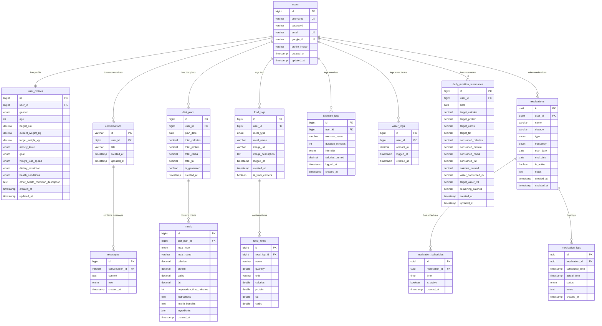

# HealVerse Database ER Diagram (Mermaid)

## How to View
1. Copy the mermaid code block
2. Paste it in GitHub README or GitLab documentation
3. Use VS Code with Mermaid extension
4. Visit [Mermaid Live Editor](https://mermaid-js.github.io/mermaid-live-editor/)
